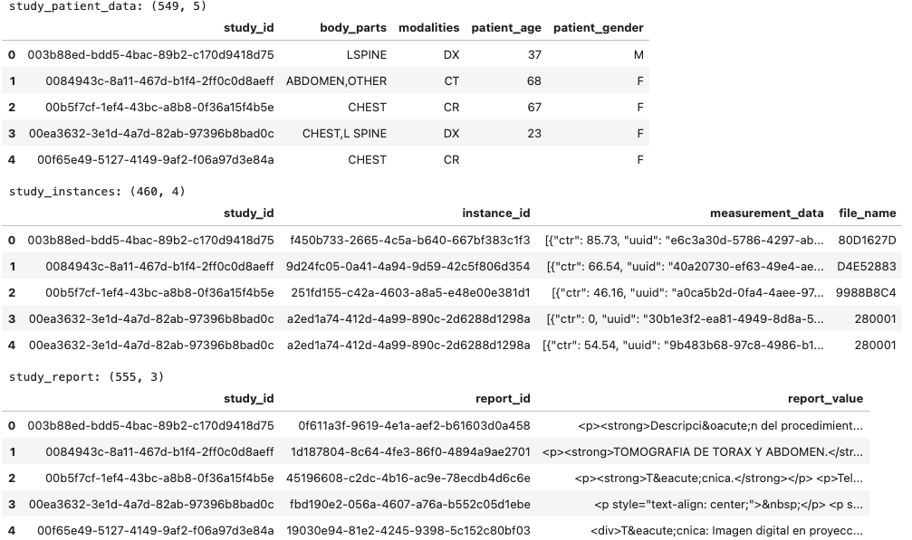
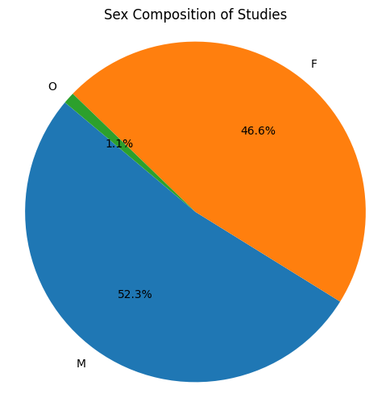
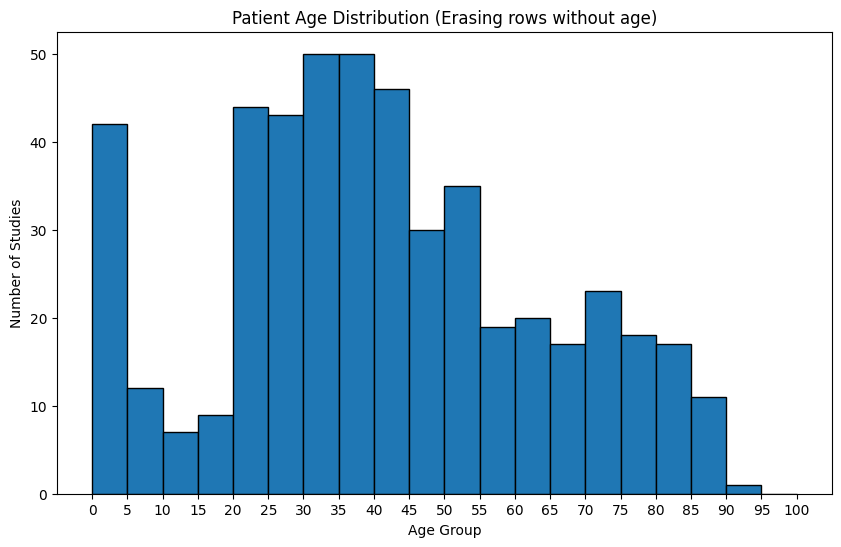
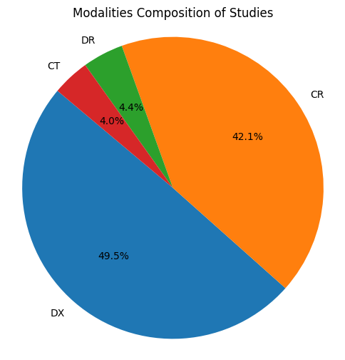
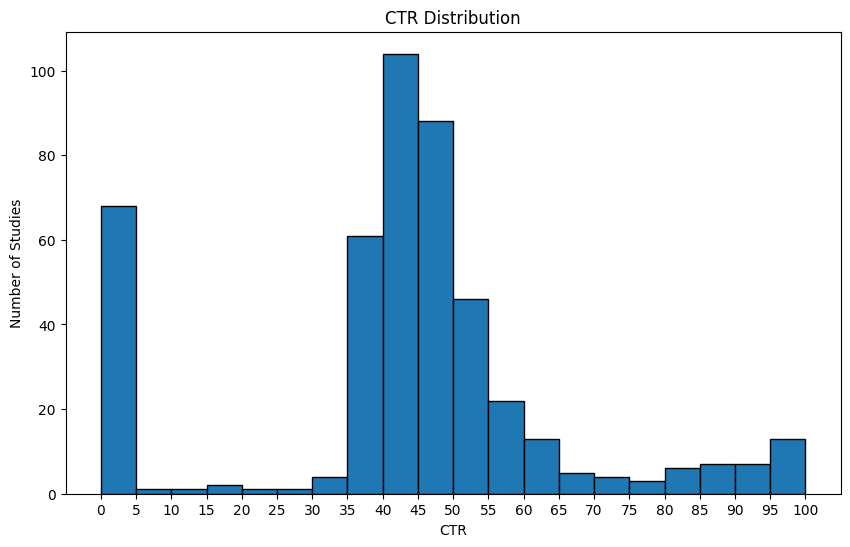
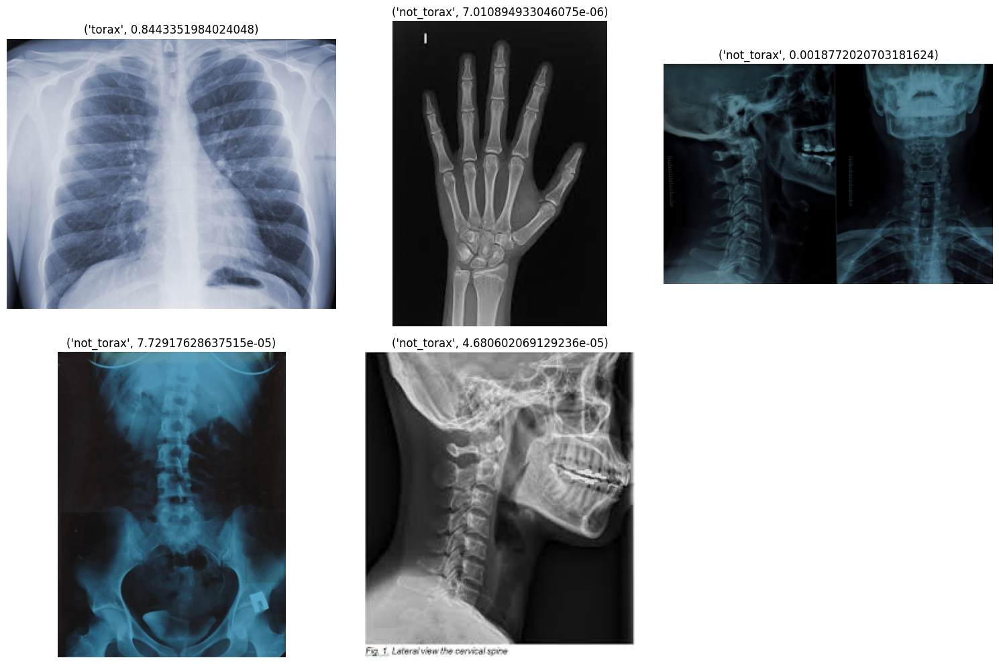
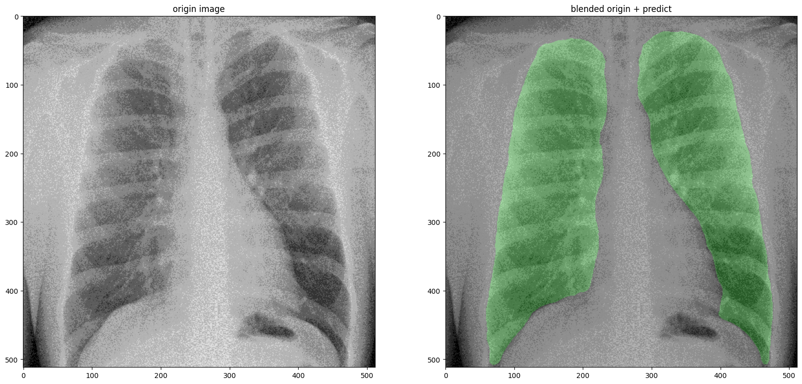
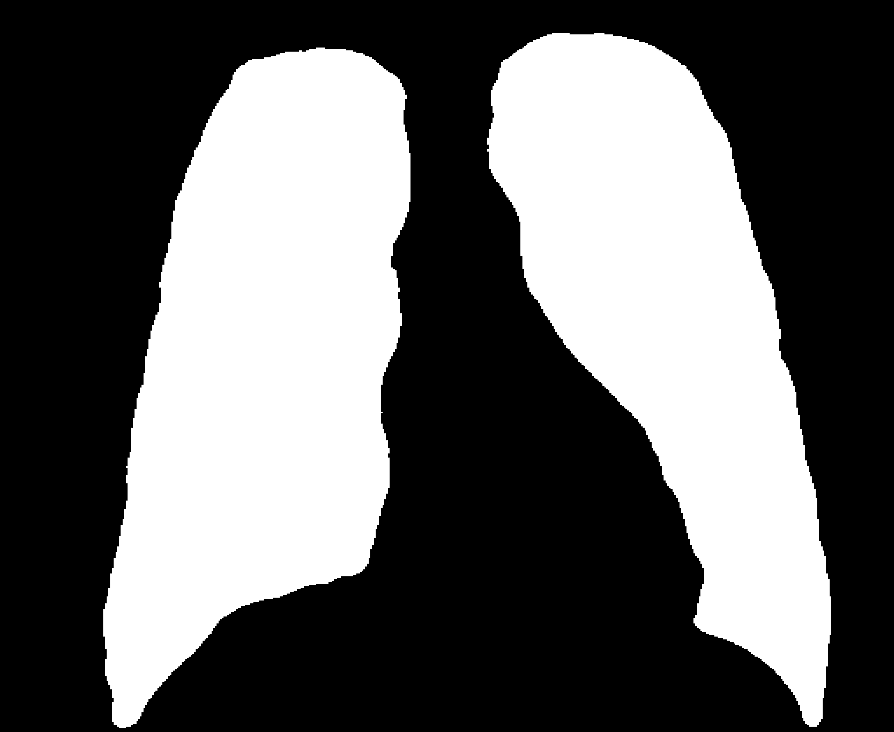

# EdenMed Segmentation Challenge

# Informe

Las siguientes secciones incluyen la guía paso a paso de cómo se ha resuelto el challenge.

## Data exploration

En la base de datos suministrada hay 3 tablas:

> Table: study_patient_data
>  Columns: study_id, body_parts, modalities, patient_age, patient_gender
> Rows: 549

Contiene información sobre el estudio en particular (tipo de modalidad, sección estudiada, datos del paciente).

> Table: study_instances
>  Columns: study_id, instance_id, measurement_data, file_name
>  Rows: 460

Para cada estudio, contiene una serie de datos de medición e imágenes asosciadas.
Nota: para cada `study_id` se encontró un único `file_name` asosciado.

> Table: study_report
>  Columns: study_id, report_id, report_value
>  Rows: 555
>

Para cada estudio, contiene un reporte en HTML escrito en lenguaje natural español.



**Otras Observaciones:**
- `study_patient_data` contiene una única fila por `study_id`.
- `study_instances` contiene varias instancias por `study_id`, pero una única imagen respectiva `file_name`.
- `study_id` contiene varios reportes por `study_id`.
- Existen `sutdy_id` que no tienen imágenes asosciadas (esto se desprende simplemente de ver la cantidad de filas).
- Existen `file_name` para los cuales no existe una imagen jpeg respectiva.

Todas  estas observaciones pueden corroborarse ejecutando `python db.py` que correrá estos chequeos.

### Exploración de características demográficas de los pacientes

Se ha calculado:
- La composición de los estudios por sexo.
- La composición de los estudios por edad del paciente.
- La composición de los estudios por modalidad (CT, CX, DT, DX).
- La distribución de los CTR.
**Nota**: el código que genera los gráficos está en la notebook: `notebook.ipynb`







### Propuesta para el análisis de los reportes médicos

Para el análisis de los reportes médicos se propone generar una ontología para cada reporte.
Por ejemplo el reporte:

````{verbatim}
La arteria pulmonar de 16mm. (normal hasta 17mm).La región parahiliar sin ensanchamientos que sugieran alteraciones. El mediastino superior de aspecto normal. La silueta cardiaca con eje aparentemente normal, de perfiles y contornos conservados con un índice cardiotorácico de .42 (normal hasta .5) Las estructuras vasculares, vena cava superior, aorta y arterias pulmonares sin alteraciones.
````

Generaría la siguiente ontología:
```
arteria_pulmonar.mm = 16
region_parahiliar.ensanchamientos = False
mediastino_superior.normal = True
silueta_cardiaca.normal = True
indice_cardiotoracico = 0.42
estructuras_vasculares.alteraciones = False
vena_cava_superior.alteraciones = False
aorta.alteraciones = False
arterias pulmonares.alteraciones = False
```

El prompt para generar dichas ontologías se encuentra en `ontology.py`

## Construcción del dataset

#### Unificando las tablas

Tener 3 tablas normalizadas es útil para el funcionamiento de un sistema transaccional. Pero a la hora de operar con datos de forma analítica lo mejor es tener toda la información en **una sóla tabla** (por más que no esté normalizada). Para ello se:
1. Agrupó por `study_id` las tablas `study_instances` y `study_report`. Las columnas se agregaron como listas de valores.
2. Se hizo un merge (JOIN de tablas) por `study_id`.
3. Se eliminaron filas que no contenían un `file_name` o para el cuál no existían imágenes asosciadas.

Esto se encuentra en la función `db.create_dataset`:

#### Seleccionando las imágenes de tórax

Ahora debemos seleccionar las imágenes que correspondan efectivamente a torax. Analizando los `body_parts` vemos los siguientes valores:

> {'TÓRAX', 'L SPINE', 'TORAX TORAX LATERAL', 'COLUMNA', 'BREAST', 'DEFAULT', 'LSPINE', 'SHOULDER', 'COLUMNA COLUMNA-L/S LATERAL', 'Pectoral', 'COL. LUMBAR', 'CSPINE', 'TORAX', 'PELVIS', 'TORAX TORAX PA', 'Senos Paranasales', 'NECK', 'THORAX', 'SPINE LUMBAR', 'PNS', 'L-SPINE', 'ABDOMEN', 'CHEST', 'OTHER', 'L/S-SPINE', 'HEAD', 'COLUMNA COLUMNA-L/S AP', 'ANGIO'}

Para seleccionar vamos a realizar los siguientes pasos:
1. Una primera selección naive, basada en `body_parts` razonables, para separarlos en clases `torax` y `not_torax`.
2. Limpiar a manualmente cada una de las dos carpetas. Para eso:
a. Viendo las miniaturas de las imágenes en `torax` seleccionamos las que no sean de torax y las movemos a la carpeta `not_torax_cleaned`.
b. Viendo las miniaturas de las imágenes en `not_torax` seleccionamos las que SI sean de torax y las movemos a la carpeta `torax_cleaned`.
c. Finalmente copiamos los archivos restantes en `not_torax` y `torax` a `torax_cleaned` y `not_torax_cleaned`.
**Observacion**: podemos hacer un limpiado a mano rápidamente viendo las imágenes como minuaturas por dos razones. En primer lugar nuestras clases son fácilmente identificables (podemos hacerlo viendo la miniatura). En segundo lugar, tenemos pocas imágenes (alrededor de 300).
Luego de este paso estaremos en condiciones de **entrenar un clasificador binario** lo que nos permitirá tener una selección más precisa para imágenes futuras (para las cuales, además, podemos no tener datos como `body_part`).
3. Pondremos estas dos clases en la carpeta `binary_dataset` y entranaremos un clasificador binario basado en `Resnet`.

El modelo de selección de tórax quedó guardado en `models/torax_detector_model.pth` y puede ser usado en una imagen de la siguiente manera:
```
python torax_detection.py --image data/test_classifier/a.jpg --model models/torax_detector_model.pth
```
Output (clase y probabildiad respectiva):
> torax 0.84

Ejemplos de imágenes de internet clasificadas:



## Segementando pulmones

Para la segmentación pulmonar se ha utilizado una arquitectura U-Net (ver Apéndice II: Referencias).
La misma ha sido entrenada con **Montgomery** y **Shenzhen** datasets de readiografías de torax (ver Apéndice I: Datasets).
El código que se ha utilizado es el de [Repositorio de segmentación pulmonar (GitHub)](https://github.com/IlliaOvcharenko/lung-segmentation).

Un ejemplo de una imágen del dataset superpuesta con la máscara generada por el modelo:



Se puede utilizar el modelo de segmentación en una imágen con el comando:
```
python segmentation.py --image data/test_classifier/a.jpg --model models/unet-6v.pt --out mask.jpg
```

El comando anterior generará una imagen blanco y negro con la máscara en el path que se le indique en el argumento --out



Las imágenes de `data/binary_classifier/torax` se han procesado con el segmentador y guardado en `data/binary_classifier_torax_mask`

### Por qué elegimos esta implementación?

La razón de por qué elegimos [este repositorio](https://github.com/IlliaOvcharenko/lung-segmentation) es porque ya proveía los pesos del modelo entrenado en un dataset conocido. **Y más importante aún posee:**
- El código de entrenamiento mediante el cual podemos verificar que ha sido entrenado correctamente (con splits de train, validación y test).
- Los splits (`splits.pk`) que nos permite replicar el entrenamiento realizado.


# Apéndice I: Datasets

**Montgomery Dataset**  
- **Origen:** Montgomery County, Maryland, USA  
- **Número de imágenes:** ~138  

**Shenzhen Dataset**  
- **Origen:** Hospital Nº3 de Shenzhen, China  
- **Número de imágenes:** ~662

Ambos datasets se encuentran en el siguiente [archivo](https://drive.google.com/file/d/1ffbbyoPf-I3Y0iGbBahXpWqYdGd7xxQQ/view). El directorio `images` contiene las radiografías y `masks` el source of truth de las máscaras. Las máscaras tienen el mismo nombre que su respectiva imágen y se le ha adicionado el sufijo `_mask`. Los archivos del Shenzhen Dataset comienzan con `CHNCXR`.

```
📁 dataset/
├── 📁 images/
│   ├── CHNCXR_0001_0.png  
│   ├── CHNCXR_0002_0.png  
│   ├── ...  (662 archivos)
│   ├── MCUCXR_0001_0.png    
│   └── ...  (138 archivos)
└── 📁 mask/
    ├── CHNCXR_0001_0_mask.png  
    ├── CHNCXR_0002_0_mask.png  
    ├── ...  (662 archivos)
    ├── MCUCXR_0001_0_mask.png  
    └── ...  (138 archivos)
```

# Apéndice II: Referencias

Ronneberger, O., Fischer, P., & Brox, T. (2015). U-Net: Convolutional Networks for Biomedical Image Segmentation. *In Proceedings of the International Conference on Medical Image Computing and Computer-Assisted Intervention (MICCAI)* (pp. 234–241). Springer. https://doi.org/10.1007/978-3-319-24574-4_28
